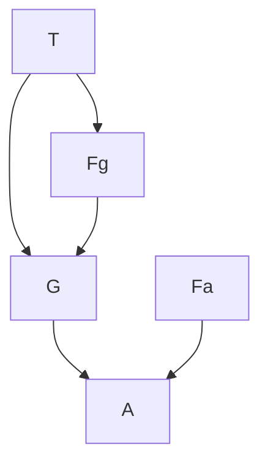

# AI2 - Exercise 1

### Task 1:

##### A) If no Evidence is observed, are *burglary* and *earthquake* conditionally indipendent?

**Conditional Independence** is defined for two variables $X_1$ and $X_2$ given evidence vaiables $E$ as: 

$$
\mathrm{P}(X_1, X_2|E) = \mathrm{P}(X_1|E) \cdot \mathrm{P}(X_2|E)
$$

Since no evidence is given we want to prove $\mathrm{P}(B, E) = \mathrm{P}(B) \cdot \mathrm{P}(E)$

From the topological definition on a Bayesian Network the probability of a conjunction of variables is defined as:

$$
\mathrm{P}(X_1, \cdots, X_n) = \prod_{i=1}^{n}\mathrm{P}(X_i|parents(X_i))
$$

where $parents(X_I) = Parents(X_i)\cap {X_1, \cdots, X_n}$

Because $B$ and $E$ are not parents on each other, by the topological definition it follows that:

$$
\mathrm{P}(B, E) = \mathrm{P}(B|\quad) \cdot \mathrm{P}(E|\quad) = \mathrm{P}(B) \cdot \mathrm{P}(E) \quad \square
$$

##### B) If we observe *alarm*, are *burglary* and *earthquake* still independent?

If $B$ and $E$ are coditional independent given $A$ the following must hold.

$$
\mathrm{P}(B, E|A) = \mathrm{P}(B|A) \cdot \mathrm{P}(E|A)
$$

Now we apply Bayes rule $\mathrm{P}(X|Y) = \frac{\mathrm{P}(Y|X)\mathrm{P}(X)}{\mathrm{P}(Y)}$on the left side and the product rule $\mathrm{P}(X, Y) = \mathrm{P}(X|Y) \cdot \mathrm{P}(Y)$ on the right side of the equation.

$$
\mathrm{P}(B, E) \cdot \frac{\mathrm{P}(A|B, E)}{\mathrm{P}(A)} = 
\frac{\mathrm{P}(A, B)}{\mathrm{P}(A)} \cdot 
\frac{\mathrm{P}(A, E)}{\mathrm{P}(A)}
$$

Next we split $\mathrm{P}(B, E)$ up due to their conditional independence from **Task 1 A)**  and we sum out some terms on the right side $\mathrm{P}(X) = \sum_{e\in E} \mathrm{P}(X, e)$.

$$
\mathrm{P}(B) \cdot \mathrm{P}(E) \cdot \frac{\mathrm{P}(A|B, E)}{\mathrm{P}(A)} = 
\frac{\mathrm{P}(A, B, E) + \mathrm{P}(A, B, \neg E)}{\mathrm{P}(A)} \cdot 
\frac{\mathrm{P}(A, B, E) + \mathrm{P}(A, \neg B, E)}{\mathrm{P}(A)}
$$

Now we multiply by $\mathrm{P}(A)$ twice and the use the product rule again to condition the joint probabilities on $A$.

$$
\mathrm{P}(A) \cdot \mathrm{P}(B) \cdot \mathrm{P}(E) \cdot 
\mathrm{P}(A|B, E) = \newline 
\left [ \mathrm{P}(A| B, E) \cdot \mathrm{P}(B) \cdot \mathrm{P}(E) + 
\mathrm{P}(A| B, \neg E) \cdot \mathrm{P}(B) \cdot \mathrm{P}(\neg E) \right ]  \cdot \newline 
\left [ \mathrm{P}(A| B, E) \cdot \mathrm{P}(B) \cdot \mathrm{P}(E) +
\mathrm{P}(A| \neg B, E)\cdot \mathrm{P}(\neg B) \cdot \mathrm{P}(E) \right ]
$$

Multiplying the right side out gives:

$$
\mathrm{P}(B) \cdot \mathrm{P}(E) \cdot \mathrm{P}(A) \cdot 
\mathrm{P}(A|B, E) = \newline 
\mathrm{P}(A| B, E) \cdot \mathrm{P}(B) \cdot \mathrm{P}(E) \cdot \mathrm{P}(A| B, E) \cdot \mathrm{P}(B) \cdot \mathrm{P}(E) + \newline
\mathrm{P}(A| B, E) \cdot \mathrm{P}(B) \cdot \mathrm{P}(E) \cdot \mathrm{P}(A| B, \neg E) \cdot \mathrm{P}(B) \cdot \mathrm{P}(\neg E) + \newline
\mathrm{P}(A| \neg B, E)\cdot \mathrm{P}(\neg B) \cdot \mathrm{P}(E) \cdot \mathrm{P}(A| B, E) \cdot \mathrm{P}(B) \cdot \mathrm{P}(E) + \newline
\mathrm{P}(A| \neg B, E)\cdot \mathrm{P}(\neg B) \cdot \mathrm{P}(E) \cdot \mathrm{P}(A| B, \neg E) \cdot \mathrm{P}(B) \cdot \mathrm{P}(\neg E) 

$$

Dividing by $\mathrm{P}(B)$ and $\mathrm{P}(E)$ yields:

$$
\mathrm{P}(A) \cdot 
\mathrm{P}(A|B, E) = \newline 
\mathrm{P}(A| B, E) \cdot \mathrm{P}(A| B, E) \cdot \mathrm{P}(B) \cdot \mathrm{P}(E) + \newline
\mathrm{P}(A| B, E) \cdot \mathrm{P}(A| B, \neg E) \cdot \mathrm{P}(B) \cdot \mathrm{P}(\neg E) + \newline
\mathrm{P}(A| \neg B, E)\cdot \mathrm{P}(\neg B) \cdot \mathrm{P}(E) \cdot \mathrm{P}(A| B, E)  + \newline
\mathrm{P}(A| \neg B, E)\cdot \mathrm{P}(\neg B)  \cdot \mathrm{P}(A| B, \neg E) \cdot \mathrm{P}(\neg E) 
$$

And dividing by $\mathrm{P}(A|B,E)$ we get.

$$
\mathrm{P}(A) = \newline 
\mathrm{P}(A| B, E) \cdot \mathrm{P}(B) \cdot \mathrm{P}(E) + \newline
\mathrm{P}(A| B, \neg E) \cdot \mathrm{P}(B) \cdot \mathrm{P}(\neg E) + \newline
\mathrm{P}(A| \neg B, E)\cdot \mathrm{P}(\neg B) \cdot \mathrm{P}(E)  + \newline
\frac{\mathrm{P}(A| \neg B, E)\cdot \mathrm{P}(\neg B)  \cdot \mathrm{P}(A| B, \neg E) \cdot \mathrm{P}(\neg E)}{\mathrm{P}(A|B, E)} 
$$

We note the righthand side for the moment and sum $\mathrm{P}(A)$ out.

$$
\mathrm{P}(A) = \mathrm{P}(A, B, E) + \mathrm{P}(A, B, \neg E) + \mathrm{P}(A, \neg B, E) + \mathrm{P}(A, \neg B, \neg E) 
$$

We then use the product rule to contition the joint probabilities on $A$:

$$
\mathrm{P}(A) = 
\mathrm{P}(A| B, E) \cdot  \mathrm{P}(B) \cdot \mathrm{P}(E) +  
\mathrm{P}(A| B, \neg E) \cdot \mathrm{P}(B) \cdot \mathrm{P}(\neg E)+ \newline
\mathrm{P}(A| \neg B, E) \cdot \mathrm{P}(\neg B)\cdot \mathrm{P}(E)+ 
\mathrm{P}(A| \neg B, \neg E) \cdot \mathrm{P}(\neg B) \cdot \mathrm{P}(\neg E)
$$

No we can bring back our previous terms and equate them to get

$$
\cancel{\mathrm{P}(A| B, E) \cdot  \mathrm{P}(B) \cdot \mathrm{P}(E)} + \newline 
\cancel{\mathrm{P}(A| B, \neg E) \cdot \mathrm{P}(B) \cdot \mathrm{P}(\neg E)} + \newline
\cancel{\mathrm{P}(A| \neg B, E) \cdot \mathrm{P}(\neg B)\cdot \mathrm{P}(E)} + \newline
\mathrm{P}(A| \neg B, \neg E) \cdot \cancel{\mathrm{P}(\neg B)} \cdot \cancel{\mathrm{P}(\neg E)} = \newline
\cancel{\mathrm{P}(A| B, E) \cdot \mathrm{P}(B) \cdot \mathrm{P}(E)} + \newline
\cancel{\mathrm{P}(A| B, \neg E) \cdot \mathrm{P}(B) \cdot \mathrm{P}(\neg E)} + \newline
\cancel{\mathrm{P}(A| \neg B, E)\cdot \mathrm{P}(\neg B) \cdot \mathrm{P}(E)} + \newline
\frac{\mathrm{P}(A| \neg B, E)\cdot \cancel{\mathrm{P}(\neg B)} \cdot 
\mathrm{P}(A| B, \neg E) \cdot \cancel{\mathrm{P}(\neg E)}}
{\mathrm{P}(A|B, E)} 
$$

which simplifies to:

$$
\mathrm{P}(A| \neg B, \neg E) = 
\frac{\mathrm{P}(A| \neg B, E)\cdot 
\mathrm{P}(A| B, \neg E)}
{\mathrm{P}(A|B, E)} 
$$

One final division and we get our constraint:

$$
\mathrm{P}(A|B, E) \cdot \mathrm{P}(A| \neg B, \neg E) = 
\mathrm{P}(A| \neg B, E) \cdot \mathrm{P}(A| B, \neg E)
$$

If this constraint is met, than $B$ and $E$ are concitionally independent, otherwise they are not. Looking those values up in the **CPT** we get:

$$
0.95 \cdot 001 \ne 0.94 \cdot 0.29
$$

Therefore $B$ and $E$ are not conditionally independent given $A$. 

### Task 2:

In your local nuclear power station, there is an alarm that senses when a temperature gauge exceeds a certain threshold. The gauge measures the temperature of the core. Consider the Boolean variables $A$ (alarm sounds), $F_A$(alarm is faulty), $F_G$(gauge is faulty) and the multivalued nodes $G$ (gauge reading) and $T$ (actual core temperature).

##### A) Draw a Bayesian Network for the domain, given that the gauge is more likely to fail if the temperatur is high

##### B) Is this network a Polytree?

A polytree is a directed acyclical graph whose undelying undirected graph is a tree. That means that if we replace each directed edge with an undirected edge, the resulting graph is contains no cycles. In the graph from **A)** the underlying undirected graph contains the cycle $T, F_G, G$. Therefore it is not a Polytree.

##### C) Suppose there are just two possible actual and measured temperatures, normal and high: the probability that the gauge gives the correct temperature is $x$ when it is working, but $y$ when it is faulty. Give the conditional probability table associatedwith $G$.

| $\mathrm{P}(G=T)$ | $ F_G$    | $\neg F_G$ |
| ----------------- | --------- | ---------- |
| $T=\text{normal}$ | $\mu$     | $\eta$     |
| $T=\text{high}$   | $y - \mu$ | $x - \eta$ |

##### D) Suppose the alarm works correctly unless it is faulty, in which case it never sounds. Give the conditional probability table associated with $A$.

| $\mathrm{P}(A)$   | $F_A$ | $\neg F_A$ |
| ----------------- | ----- | ---------- |
| $G=\text{normal}$ | $0$   | $\phi$     |
| $G=\text{high}$   | $0$   | $\psi$     |

##### E) Suppose the alarm and gauge are working and the alarm sounds. Calculate an expression for the probability that the temperature of the core is too high, in terms of the various conditional probabilites in the network.

$$
\mathrm{P}(T=\text{high}|A, \neg F_A, \neg F_G)
$$

Applying the product rule $\mathrm{P}(X|Y) = \frac{\mathrm{P}(X, Y)}{\mathrm{P}(Y)}$:

$$
\frac{\mathrm{P}(T=\text{high}, A, \neg F_A, \neg F_G)}
{\mathrm{P}(A, \neg F_A, \neg F_A)}
$$

Applying the topological definition $\mathrm{P}(X_1, \cdots, X_n) = \prod_{i=1}^{n}\mathrm{P}(X_i|parents(X_i))$.

$$
\frac{\mathrm{P}(T=\text{high}) \cdot 
\cancel{\mathrm{P}(A|\neg F_A) \cdot 
\mathrm{P}(\neg F_A) \cdot}
\mathrm{P}(\neg F_G|T=\text{high})}
{\cancel{\mathrm{P}(A|\neg F_A) \cdot
\mathrm{P}(\neg F_A)} \cdot
\mathrm{P}(\neg F_G)}
$$

$$
\frac{\mathrm{P}(T=\text{high}) \cdot 
\mathrm{P}(\neg F_G|T=\text{high})}
{\mathrm{P}(\neg F_G)}
$$

Applying the rule $\mathrm{P}(X) = \sum_{y\in Y}\mathrm{P}(X, y)$.

$$
\frac{\mathrm{P}(T=\text{high}) \cdot 
\mathrm{P}(\neg F_G|T=\text{high})}
{\mathrm{P}(\neg F_G, T=\text{normal}) + \mathrm{P}(\neg F_G, T=\text{high})}
$$

All remaining four terms can now be read off the **CPT**.
